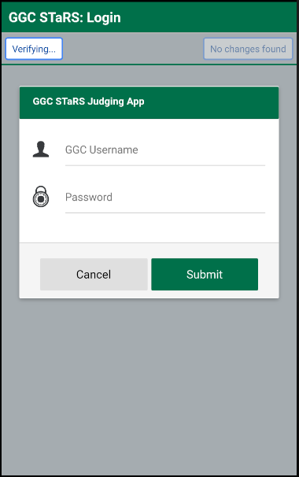
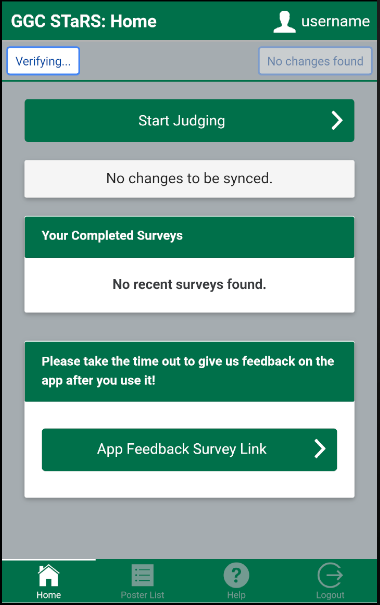
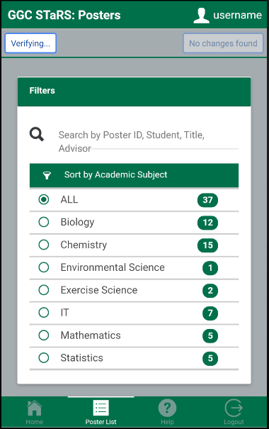
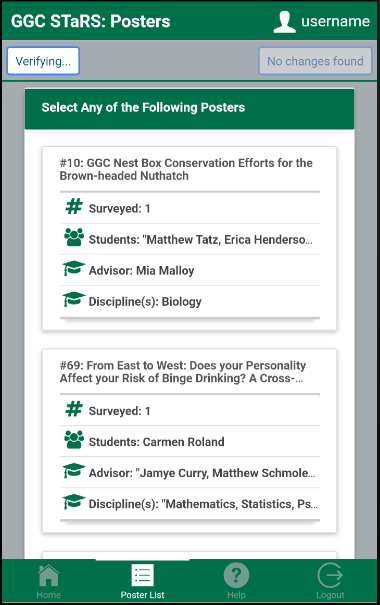
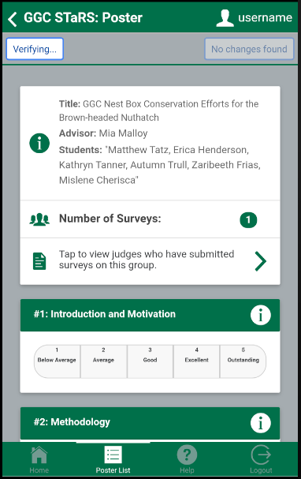
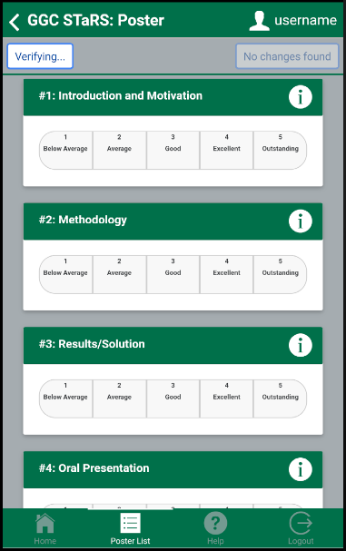

# STaRS
Mobile application used by judges at the annual GGC STaRS event to submit and manage surveys conducted on research groups. 
Works offline with the use of PouchDB and CouchDB.

## Team

* **Team Polaris** - Fall 2019

## Repo Location URL

* https://github.com/soft-eng-practicum/STaRS

## Progess tracking tool

* TBA

## Communication tool

* [Discord](https://discordapp.com/)

## Members

1.
2. **Juan Linares** : Lead Programmer & Testing Lead :ghost:
3.
4.

## Installation

1. `npm` is required to install packages and run the app
1. Install Ionic and Cordova
    1. `npm install -g ionic`
    1. `npm install -g cordova`
1. Clone repository
1. Navigate to folder location in a terminal and run `npm i` to install dependencies

## How to Run

* After installation navigate to folder in a terminal
* Can be served to the browser with `ionic serve`

### Android

* Can be run with an Android Studio emulator with `ionic cordova emulate android`
* Can be run on connected device as well
  * If only one Android device attached use `ionic cordova run android`
  * If multiple Android devices attached must specify device
    * To get device list run `ionic cordova run android --list`
    * Run to targeted device with `ionic cordova run android --target=e78ab88d`

### iOS

* **Can only be run/emulated on Apple computer**
* Create an Xcode project using the STaRS directory
  * Ionic will now launch the app using Xcode
* Emulation for iOS
  * `ionic cordova emulate ios`
* Run on Apple device
  * `ionic cordova run ios`

## Functionality

* Changes will show in the upper right corner when user is logged in
* User has to tap to sync database changes

### Login

### Home

### Poster List

### Poster Details

### Poster Scoring

